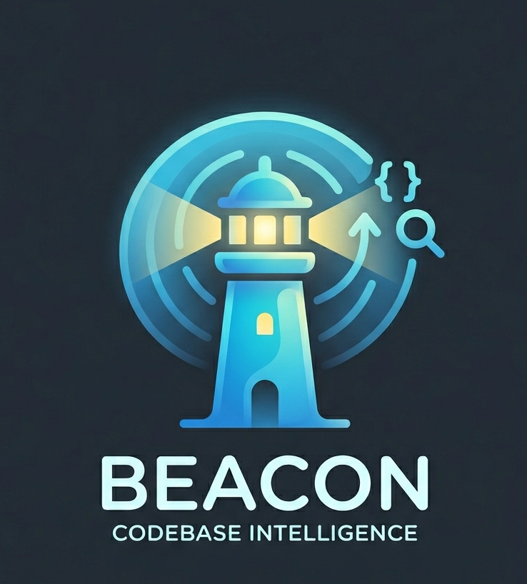

<p align="center">
  
</p>

<p align="center">
  <strong>The agentic dev loop, in Slack — cited answers, PR reviews, fix PRs,
  and CI triage, grounded in your actual code down to the file and line.</strong>
</p>

<p align="center">
  <a href="https://askbeacon.dev"><strong>Website</strong></a> ·
  <a href="docs/architecture.md">Architecture</a> ·
  <a href="docs/setup.md">Setup</a> ·
  <a href="docs/usage.md">Usage</a> ·
  <a href="docs/security.md">Security</a> ·
  <a href="docs/open-source.md">Open source</a> ·
  <a href="docs/roadmap.md">Roadmap</a> ·
  <a href="LICENSE">License</a>
</p>

## Demo

https://github.com/user-attachments/assets/011c8d06-e78d-4856-93fd-5f3bab9542a6

```
you   ▸ @bot why does the create-PR flow go through a queue instead of waitUntil?
bot   ▸ Because Cloudflare cancels waitUntil work ~30s after the response is
        sent, and PR creation (LLM edit generation + GitHub API calls) can
        exceed that [1][2]. The slash handler enqueues a job instead…
        Sources: workers/slack-bot/wrangler.toml:31-38 · src/actions/createPr.ts:24-61
```

## The problem

Engineering knowledge lives in code, but questions get asked in Slack. The gap
gets filled by interrupting whoever wrote the code, spelunking through repos, or
trusting an LLM that has never seen your codebase and invents plausible
nonsense. Generic AI assistants can't cite your code; code search can't answer
questions.

**Beacon runs the dev loop between GitHub and Slack.** It indexes your repos
into a semantic + lexical + call-graph index, then works the whole cycle from
the thread: cited answers, PR reviews, fix PRs, and CI-failure triage — every
action grounded **only in retrieved evidence**.

## Why it's different

- **Grounded or silent.** Every answer is built from retrieved code and cited
  `repo/path:lines`. No evidence, no answer — it abstains instead of guessing.
- **It traces "why," not just "what."** An agentic planner inspects the first
  round of results and runs follow-up tools — search, read file, walk callers
  and callees over the code graph — before answering multi-hop questions.
- **Lives where the work happens.** Channels, DMs, and the Slack assistant pane.
  Answers stream in token-by-token and use thread history to resolve follow-ups.
- **Zero servers to babysit.** Cloudflare Workers, Cloudflare Pages Functions,
  and a GitHub Actions indexing pipeline. Nothing to keep warm, nothing to
  operate.

## What it does

- **Grounded Q&A** — `/ask-code <question>` or `@bot <question>`. Answers stream
  with a `Sources` list and abstain when the evidence isn't there.
- **Agentic retrieval** — a planner LLM runs follow-up search / read / graph
  tools when the first pass is missing something. Time-budgeted, with graceful
  fallback to single-shot retrieval.
- **Hybrid search** — BM25 full-text (SQLite FTS5) + vector similarity
  (Vectorize + `embeddinggemma-300m`) + one-hop expansion over `CALLS` /
  `IMPORTS` edges, merged and reranked with symbol and diversity heuristics.
- **PR review** — paste a PR URL (or react with an emoji) and get a streamed
  review informed by the indexed codebase.
- **PR creation** — describe an issue in a thread, react with :rocket:, and the
  bot proposes file edits and opens a pull request.
- **CI-failure triage** — when a GitHub Actions run fails on an indexed repo,
  Beacon posts a *cited diagnosis* to the repo's Slack channel — grounded in the
  failing logs and the head commit's diff — and a :rocket: reaction opens a fix
  PR. Transient/infra flakes (timeouts, rate limits, OOM) get a re-run nudge
  instead of a false alarm.
- **Admin onboarding portal** — the existing Pages site includes a guided
  `/admin/onboarding` flow for Slack OAuth, GitHub App connection, repo
  selection, indexing status, channel mapping, and the first cited answer.
- **Self-serve indexing** — select repos in the admin portal or run
  `@bot index owner/repo` from Slack; `index status` shows live progress per
  repo.
- **Fully automatic indexing** — install the companion GitHub App and every push
  to the default branch incrementally reindexes only the changed files. No
  commands, no servers.

## How it works

```
 Cloudflare Pages admin ──Slack OAuth · GitHub App · repo picker──▶ D1 tenants
                                                                        │
 Slack ──/ask-code · @mention · DM · emoji──▶ slack-bot (CF Worker)      │
                                              │  verify → route → tenant │
                                              │  scoped retrieval → LLM  │
                                              │  streamed + cited        │
                                              ▼                         │
                       D1 (tenants + FTS5 + graph) · Vectorize (768d vectors)
                                              ▲
 GitHub App ──push──▶ github-webhook (CF Worker) ──▶ Queue ──▶ GitHub Actions
                       (App installation token → tree-sitter → redaction → embed → upsert)
```

**Stack:** npm-workspaces TypeScript monorepo · Cloudflare Workers, D1
(SQLite + FTS5), Vectorize, Queues, Workers AI · Cloudflare Pages Functions ·
GitHub App installation auth for tenant GitHub access · GitHub Actions as the
Node indexer runner. Shared package utilities own schema/types plus
cross-runtime repo parsing, encoding, secret crypto, and GitHub dispatch
plumbing. Full walkthrough in [docs/architecture.md](docs/architecture.md).

## Licensing

Beacon's implementation is open source under the MIT License. This repository
contains the Slack bot Worker, GitHub webhook Worker, Pages admin portal,
Node-based indexer, Zoekt query container, shared D1 schema/migrations, eval
harness, and deployment docs. See [LICENSE](LICENSE) and
[docs/open-source.md](docs/open-source.md).

## Get started

→ **[Set it up](docs/setup.md)** · **[Use it](docs/usage.md)** ·
**[Read the architecture](docs/architecture.md)**
