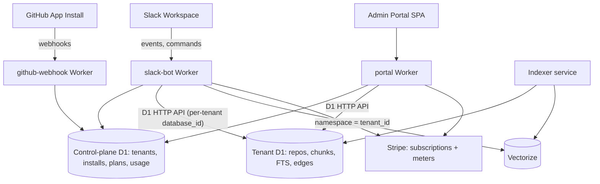

# Multi-tenant, scalable, billable Beacon

The master plan for converting Beacon from a single-tenant prototype into a
multi-tenant SaaS: Slack OAuth installs + GitHub App per tenant, a D1
database per tenant provisioned via API, per-tenant Vectorize namespaces,
usage metering, and Stripe hybrid billing (plan tiers + metered overages).

Companion design docs:

- [onboarding.md](onboarding.md) — customer onboarding flows
- [provisioning.md](provisioning.md) — automated per-tenant resource provisioning
- [sso-auth.md](sso-auth.md) — Slack-as-SSO auth model
- [rbac.md](rbac.md) — roles and repo-level access
- [emergency-handling.md](emergency-handling.md) — incident runbook
- [admin-portal.md](admin-portal.md) — customer admin portal

## Original prototype state (summary)

Single-tenant prototype: one static `SLACK_BOT_TOKEN`, one `GITHUB_PAT`, one
shared D1 (`scintel`) + Vectorize index, a global repo allowlist, no metering
or billing. Schema stubs (`slack_workspaces`, `users`) exist in
`packages/shared/schema.sql` but are unused.

The current tenant migration keeps the shared D1 control plane but stores
Slack workspaces, tenant GitHub App installations, live installation repo
grants, and tenant repo selections. Customer repo access should now use
short-lived GitHub App installation tokens; PATs are legacy/dev-only.

## Target architecture

Key idea: only the **control-plane** D1 is statically bound in
`wrangler.toml`. Each tenant's own database is created at signup via the
Cloudflare API and reached over the D1 HTTP REST API using the tenant's
`database_id` — so onboarding a customer is an API call, not a deploy.

## Phase 1 — Control plane and tenant identity

- New control-plane D1 database (statically bound as `CONTROL_DB` in both
  workers). New schema in `packages/shared/control-schema.sql`:
  - `tenants` (id, slack_team_id, d1_database_id, vectorize_namespace, plan,
    stripe_customer_id, status)
  - `slack_installations` (team_id, encrypted bot_token, bot_user_id,
    installed_by)
  - `github_installations` (installation_id, tenant_id, account login; many
    installations per tenant)
  - `github_installation_repos` (live grant cache by installation + repo)
  - `usage_events` (tenant_id, event_type, quantity, period, metadata)
- Slack OAuth v2 install flow: new routes `GET /slack/install` and
  `GET /slack/oauth/callback` in `workers/slack-bot/src/index.ts`. Encrypt
  bot tokens (AES-GCM via WebCrypto, key in a Worker secret) before storing.
- Replace every `env.SLACK_BOT_TOKEN` usage (e.g.
  `workers/slack-bot/src/stream.ts`) with a `getTenantContext(teamId)`
  lookup; `team_id` is already available in all event payloads
  (`workers/slack-bot/src/slack.ts`).
- Replace `GITHUB_PAT` with per-tenant GitHub App installation tokens (App
  JWT → installation access token, cached ~50 min). The webhook handler
  (`workers/github-webhook/src/webhook.ts`) receives `installation` events,
  syncs the grant cache, and tenant repo selections persist the
  `installation_id`.
- Tenant linking: a Slack command (e.g. `@bot connect github`) that issues a
  signed state token for the GitHub App install URL, binding
  `installation_id` to the Slack tenant.

## Phase 2 — Per-tenant data plane (D1-per-tenant + Vectorize namespaces)

- Promote the D1 REST client from `services/indexer/src/cloudflare/d1.ts`
  into `packages/shared` as a `TenantDb` client. Workers reach tenant
  databases via the Cloudflare D1 HTTP API using the tenant's
  `d1_database_id` (static bindings cannot be dynamic). Accept the extra
  ~10–30 ms latency on the query path.
- Provisioning flow (triggered on Slack install): create the D1 database via
  the Cloudflare API, apply `schema.sql` migrations, create the tenant row,
  assign Vectorize namespace = tenant id. Runs as a queue job with retries;
  tenant status `provisioning → active`. Every step is idempotent so retries
  heal partial failures.
- Vectorize isolation: one shared index, per-tenant namespace (Vectorize
  supports 50k namespaces; per-tenant indexes would hit the 100-index
  account cap). Update insert in the indexer and query in
  `workers/slack-bot/src/retrieval/vector.ts` to set/filter `namespace`.
- Thread tenant context (tenant_id, d1_database_id, namespace) through all
  queue job payloads in `packages/shared/src/types.ts` and the indexer
  (`services/indexer/src/core/indexRepo.ts`).
- Replace the global `prototype_repo_allowlist` with per-tenant repo
  registration (the tenant's own DB only contains its repos, so the
  allowlist becomes "repos in this tenant's DB").
- Migration: provision a tenant for the current workspace and copy existing
  `scintel` data into its DB; re-upsert vectors under its namespace.
- Schema upgrades later run tenant-by-tenant: a `schema_version` column on
  `tenants` plus a cron/queue job that walks tenants and applies pending
  migrations through the same HTTP API.

## Phase 3 — Scalability and abuse protection

- Per-tenant rate limiting on questions and index jobs using the Workers
  Rate Limiting binding (or a Durable Object counter keyed by tenant_id).
- Cache tenant context (decrypted token, database_id, plan) in Workers KV
  with a short TTL to avoid a control-DB read per request.
- Per-tenant indexing concurrency cap (one full index at a time per tenant)
  enforced in the queue consumer
  (`workers/github-webhook/src/consumer.ts`).
- Plan-based hard limits: max repos indexed, max repo size, questions/month —
  checked before enqueueing work.

## Phase 4 — Stripe billing (tiers + metered overage)

- Stripe products: Free (e.g. 1 repo, 50 questions/mo), Pro, Team — base
  subscription price plus metered prices for overage questions and extra
  repos, using Stripe Billing Meters.
- New routes on the slack-bot worker: `POST /stripe/webhook` (subscription
  lifecycle → update `tenants.plan`), `GET /billing/portal` (Stripe Customer
  Portal session), checkout link generation.
- Usage metering: write `usage_events` rows at answer-completion and
  index-completion; a Cron Trigger aggregates and reports meter events to
  Stripe hourly.
- Enforcement UX in Slack: when over limit, answer with an upgrade prompt +
  checkout link instead of failing silently.

## Phase 5 — Onboarding and site

- Add an "Add to Slack" install button and a pricing section to
  `site/index.html`, linking to `/slack/install` and Stripe Checkout.
- Post-install Slack DM walkthrough: connect GitHub → index first repo → ask
  first question. Full flows in [onboarding.md](onboarding.md).

## Phase 6 — Customer admin portal

Full design: [admin-portal.md](admin-portal.md).

- New `workers/portal` Worker serving a React SPA (static assets) plus its
  JSON API; binds the same `CONTROL_DB` and reuses the shared `TenantDb` and
  Stripe helpers.
- Auth: Sign in with Slack (OpenID Connect) → map workspace to tenant and
  user to role → signed short-lived session cookie. Same roles as RBAC
  (owner/admin/member); permissions enforced server-side on every API route.
- Pages: Overview (plan, quota status, warnings), Usage (charts from
  `usage_events`, per-user breakdown, projected cost, CSV export), Repos
  (status, re-index, remove, add), People & roles, Billing (Stripe Checkout
  + Customer Portal, invoices), Settings (strict mode, fix-PR policy, GitHub
  connection), Audit log, Danger zone (pause tenant, delete account/data).
- Mutations go through the same code paths and queues as the Slack commands
  and write the same per-tenant audit log.

## Key decisions

- **Isolation:** D1 database per tenant (accessed via the HTTP API from
  Workers), Vectorize namespaces per tenant. Deletion and data export are
  structural, not row-scrubbing.
- **Billing:** Stripe hybrid — plan tiers with metered overages.
- **Auth:** Slack is the SSO for both the bot and the admin portal; no
  separate logins anywhere.

## Sequencing

Phases 1 and 2 are the core refactor and should land together behind the
existing single-tenant deployment (the env-token path can remain as a
fallback until migration completes). Phases 3 and 4 can follow
independently; Phase 5 is next. Phase 6 (portal) comes last — it depends on
the control plane (1), usage metering (4), and RBAC roles existing, and
until it ships the Slack commands cover the essentials.
