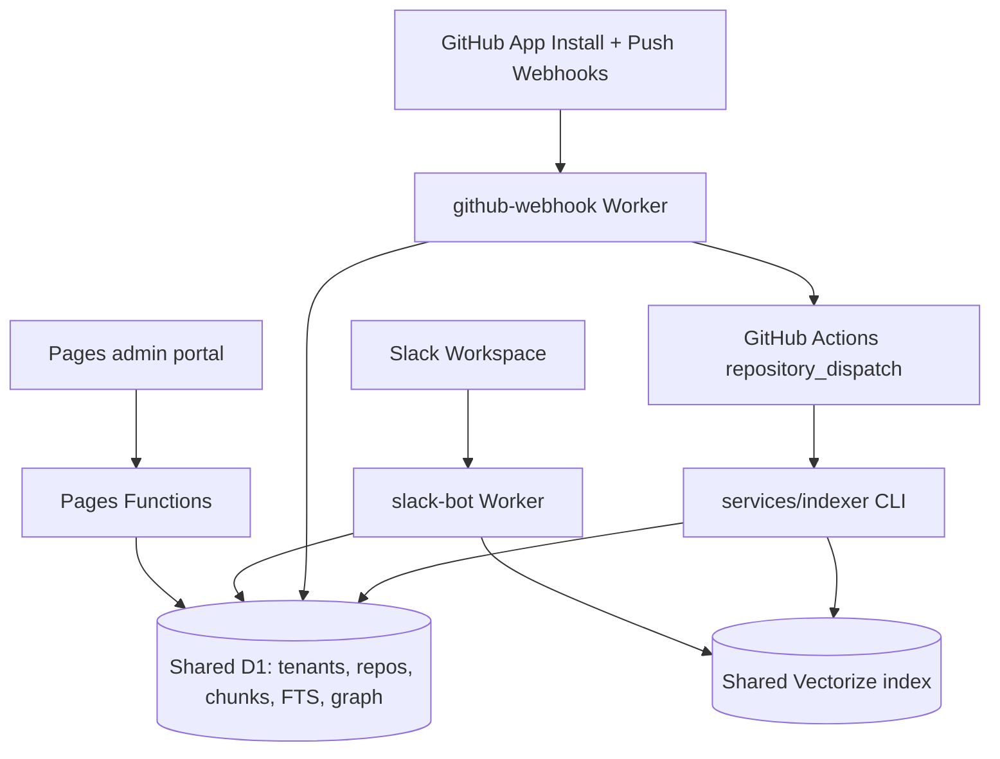
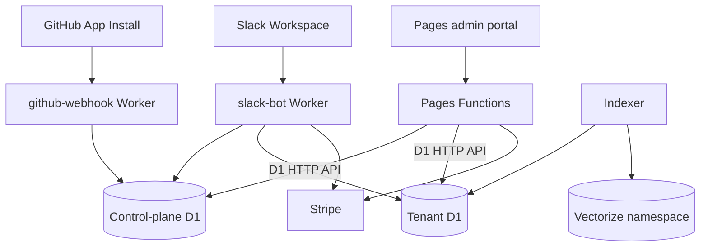

# Multi-tenant, scalable, billable Beacon

Beacon is partway through the SaaS transition. The current codebase has
tenant-scoped onboarding and repo access inside one shared D1 database. Full
per-tenant infrastructure isolation, billing, RBAC, and usage metering remain
future work.

Companion docs:

- [onboarding.md](onboarding.md) — current customer onboarding flow
- [admin-portal.md](admin-portal.md) — current Pages admin portal
- [local-verification.md](local-verification.md) — local smoke tests
- [provisioning.md](provisioning.md) — future per-tenant D1 provisioning design
- [sso-auth.md](sso-auth.md) — auth model and future strict mode
- [rbac.md](rbac.md) — future roles and per-user repo access
- [emergency-handling.md](emergency-handling.md) — incident runbook

## Current state

Shipped:

- Cloudflare Pages admin onboarding at `/admin/onboarding/`.
- Slack OAuth install records stored per tenant.
- GitHub App installation linkage, repo picker, and live installation repo
  grants.
- Tenant-scoped selected repos through `tenant_repos`.
- Tenant-scoped Slack notification channels through
  `tenant_ci_notify_channels`.
- Tenant-scoped Slack token lookup with encrypted stored bot tokens.
- GitHub App webhook path for install/push events.
- Tenant GitHub access through short-lived GitHub App installation tokens.
- Automatic indexing dispatch through GitHub Actions `repository_dispatch`,
  with tenant and installation context included in the job payload.
- Tenant-aware Slack retrieval boundaries for selected repos.
- Local verification with mock OAuth and local D1.
- Cloudflare Access protection for deployed admin paths.

Still shared:

- One D1 database: `scintel`.
- One Vectorize index.
- One indexing workflow.
- Legacy configured PAT fallback for local/internal traffic without a Slack
  tenant id.

Not shipped yet:

- D1 database per tenant.
- Vectorize namespaces per tenant.
- Stripe billing and usage metering.
- Owner/admin/member RBAC enforcement.
- Strict per-user GitHub permission mirroring.
- Customer dashboard pages for billing, people, audit log, and account deletion.

## Current architecture

The tenant boundary is currently enforced by rows and query filters, keyed by
Slack team ID. This is enough for the current onboarding/product surface, but it
is not the final structural isolation model.

## Shared code boundaries

Cross-runtime logic belongs in `packages/shared`:

- schema and migrations,
- shared types,
- repo parsing and normalized repo IDs,
- encoding helpers,
- AES-GCM secret encryption/decryption,
- GitHub `repository_dispatch` request plumbing,
- text/filtering/embedding helpers.

Domain behavior stays in runtime packages. Examples: Slack streaming and Block
Kit formatting remain in `workers/slack-bot`; richer GitHub PR/review clients
remain in `workers/slack-bot/src/github.ts`; indexer GitHub tree/tarball access
remains in `services/indexer/src/github.ts`.

## Target architecture

The long-term SaaS target is still:

- control-plane D1 for tenants, installs, plans, usage, and billing state;
- tenant D1 databases provisioned dynamically through the Cloudflare D1 HTTP
  API;
- Vectorize namespace per tenant;
- Stripe products, subscriptions, metered usage, and customer portal;
- RBAC roles and strict per-user GitHub permission sync for teams that need it;
- customer dashboard pages for usage, billing, people, audit history, and
  deletion.

## Remaining phases

1. **Structural tenant isolation** — introduce tenant D1 provisioning, tenant
   Vectorize namespaces, schema-version tracking, and tenant-by-tenant
   migrations.
2. **Billing and usage** — write `usage_events`, add Stripe Checkout/Customer
   Portal, enforce plan limits, and report metered usage.
3. **RBAC and strict mode** — owner/admin/member roles, privileged action
   checks, GitHub user linking, and per-user repo permission filters.
4. **Customer dashboard expansion** — usage charts, billing pages, people/roles,
   audit log, settings, and account deletion flows.
5. **Operational hardening** — per-tenant rate limits, concurrency caps,
   analytics, admin audit trails, and deprovisioning runbooks.

## Key decisions

- Keep onboarding inside the existing Pages app instead of creating a separate
  portal service.
- Use Slack workspace/team ID as the v1 tenant key.
- Use GitHub App installation scope for repo selection.
- Keep shared utilities in `packages/shared`; avoid copying encoding, crypto,
  repo parsing, or dispatch request logic into runtimes.
- Move to structural data isolation before selling broader multi-tenant plans.
