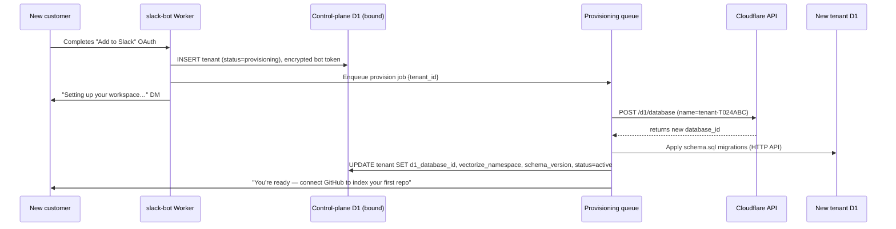

# Automated resource provisioning (multi-tenant design)

How Beacon creates real, isolated infrastructure for every new customer —
automatically, in seconds, with zero deploys and zero human steps. This is
the engineering heart of the "database per tenant" decision.

## The constraint that shapes everything

A Cloudflare Worker normally talks to D1 through a **static binding**
declared in `wrangler.toml` at deploy time:

```toml
[[d1_databases]]
binding = "DB"
database_name = "scintel"
database_id = "27722a79-..."
```

That id is fixed when the Worker is deployed. We obviously cannot redeploy
the Worker every time a customer signs up. So per-tenant databases are
**never bound**. Instead, the Worker talks to them over Cloudflare's
**D1 HTTP REST API**, where the database id is just a string in the URL:

```
POST https://api.cloudflare.com/client/v4/accounts/{account}/d1/database/{database_id}/query
Authorization: Bearer <api token>
```

The same API also **creates** databases. That is what makes provisioning
fully dynamic: onboarding a customer is a couple of API calls, not an
infrastructure change.

The indexer already uses this exact pattern today
(`services/indexer/src/cloudflare/d1.ts` queries D1 over REST with no
binding). The plan promotes that client into `packages/shared` so the
Workers use it too.

Only **one** database is statically bound: the control plane (`CONTROL_DB`),
which holds the directory of tenants — including each tenant's
`d1_database_id`.

## What gets provisioned per tenant

| Resource | How it's created | When |
|---|---|---|
| D1 database | `POST /d1/database` via Cloudflare API | Signup (queue job) |
| Schema (tables, FTS, indexes) | Run `schema.sql` migrations over the HTTP API | Same job |
| Vectorize namespace | Nothing to create — namespaces spring into existence on first vector insert with `namespace: tenant_id` | First index |
| Control-plane rows | `tenants`, `slack_installations` inserts | OAuth callback |
| Stripe customer | Created lazily on first checkout (Free plan needs none) | First upgrade |

## The provisioning flow, end to end



Step by step:

1. **The OAuth callback does almost nothing.** It writes the tenant row with
   `status = 'provisioning'`, stores the encrypted bot token, enqueues one
   job, and returns. The customer is never kept waiting on infrastructure.
2. **A queue job does the real work.** The consumer calls the Cloudflare API
   to create the database, then applies the schema migrations through the
   HTTP API. Typically completes in a few seconds.
3. **Every step is idempotent**, so queue retries heal partial failures:
   - Create database: first check "does `tenant-{team_id}` already exist?"
     (list/lookup by name) — if yes, reuse it.
   - Migrations: `CREATE TABLE IF NOT EXISTS` style (the current
     `schema.sql` already is), tracked by a migrations table inside the
     tenant DB.
   - Final update: a plain UPDATE, safe to repeat.
   A job that dies after creating the database but before migrating simply
   re-runs from the top and skips what's done.
4. **Failure is visible, not silent.** Retries exhausted → job lands in the
   dead-letter queue → ops alert. The tenant stays in `provisioning` and the
   bot answers "still setting up" instead of erroring. After the fix, the
   DLQ job is replayed — the customer never re-installs. (Runbook:
   `emergency-handling.md`, Scenario 3.)

## Steady state: how a request finds its tenant's resources

Every Slack event carries a signature-verified `team_id`. Per request:

1. Look up tenant context — `d1_database_id`, decrypted bot token, vector
   namespace, plan, status — from **Workers KV cache** (short TTL);
   fall back to the control DB on a miss.
2. `status = 'provisioning'` → friendly "still setting up" reply.
   `status = 'suspended'` → kill-switch reply. Otherwise proceed.
3. All SQL goes to `.../d1/database/{tenant.d1_database_id}/query`; all
   Vectorize operations pass `namespace: tenant.id`. The tenant context is
   resolved once per request and threaded through the whole pipeline —
   retrieval, queue payloads, the indexer — so no stage can accidentally
   default to a global database.

Cost of this design: the HTTP API adds roughly 10–30 ms per query versus a
binding. Acceptable on a chat-latency product.

## Fleet-wide schema upgrades (the ongoing cost)

With one database per tenant, a schema change must reach *every* tenant
database. Mechanism:

- `tenants.schema_version` records what each tenant database is on.
- Shipping a migration bumps the target version in code.
- A Cron Trigger walks tenants below the target and enqueues one migration
  job per tenant — same HTTP API, gradual rollout, tenant by tenant.
- A bad migration is caught on the first tenants and paused before it
  touches the rest. Migrations are written additively (new tables/columns)
  wherever possible so old code keeps working against new schema during the
  rollout window.
- New signups always provision at the latest version.

## Deprovisioning (uninstall / deletion)

The mirror image, also automatic:

1. Slack `app_uninstalled` event (or portal "Delete account") → tenant
   `status = 'suspended'`, 30-day grace timer starts (immediate on explicit
   deletion).
2. Timer fires → queue job: delete the D1 database (one API call), delete
   the vector namespace, delete control-plane rows and the Stripe customer.
3. Because isolation is structural, deletion is structural — there is no
   shared table to scrub row by row.

## Limits worth knowing

- D1: 10,000 databases per account on paid plans — the ceiling is far away,
  and is the signal to revisit sharding strategy if we ever approach it.
- Vectorize: ~50k namespaces per index — same story.
- D1 database creation is fast (seconds) and free until queried at volume,
  so provisioning ahead of need costs nothing.
